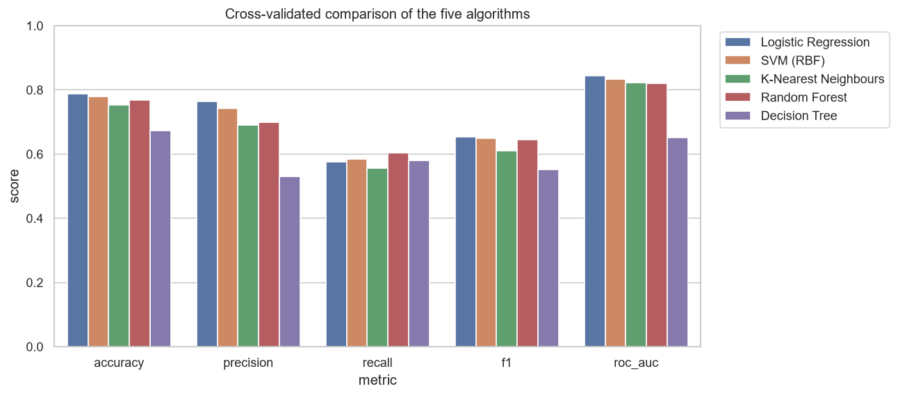
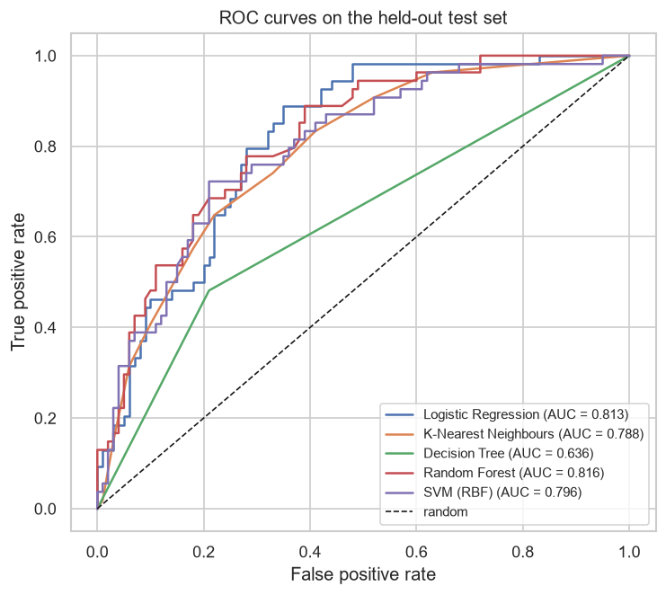
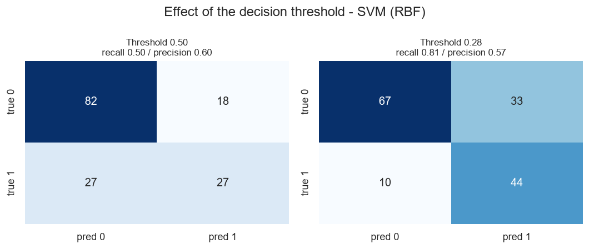
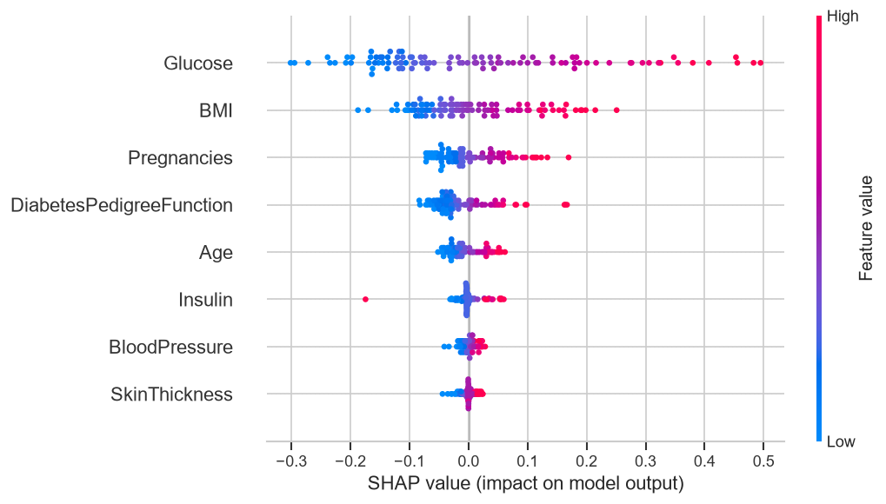

# Diabetes Prediction from Clinical Measurements

**CBIO313 — Data Mining & Machine Learning · Course Project**
Instructor: Dr. Muhammad Elsayeh


---

## Project description

Type 2 diabetes develops silently — by the time symptoms send someone to a clinic, damage to the
kidneys, retina and peripheral nerves is often already underway. Screening exists for this reason,
but a full diagnostic workup cannot be offered to an entire population.

This project builds a **screening classifier** that predicts diabetes from eight routine clinical
and demographic measurements, so that limited diagnostic capacity can be pointed at the patients who
most need it.

Two findings drive the result, and neither is about the choice of algorithm:

1. **Missing values in this dataset are recorded as zeros.** Almost half the insulin readings are
   absent but stored as `0`. A model trained on the raw file reads that as a genuine, extremely low
   insulin level — the opposite of the truth.
2. **The default 0.50 decision threshold is wrong for screening.** It optimises accuracy. Choosing
   the threshold to hit a recall target instead took the model from missing **27 of 54** diabetics to
   missing **10**, while accuracy barely moved.

| | Accuracy | Precision | Recall | Missed diabetics |
|---|---|---|---|---|
| Default threshold 0.50 | 0.708 | 0.600 | 0.500 | 27 of 54 |
| **Chosen threshold 0.285** | **0.721** | 0.571 | **0.815** | **10 of 54** |

Final model: **tuned SVM (RBF kernel)** — CV ROC-AUC **0.849**, test ROC-AUC **0.810**.

---

## Dataset source

**Pima Indians Diabetes Database** — National Institute of Diabetes and Digestive and Kidney
Diseases, distributed via the UCI Machine Learning Repository. 768 women of Pima Indian heritage,
aged 21+, near Phoenix, Arizona. 8 features, binary target, 34.9% positive.

The file is checked into [`data/diabetes.csv`](data/diabetes.csv) so the project runs offline.
Full column dictionary and the data-quality issue are documented in [`data/README.md`](data/README.md).

> Smith, J.W. et al. (1988). *Using the ADAP learning algorithm to forecast the onset of diabetes
> mellitus.* Proc. Symp. on Computer Applications in Medical Care, 261–265.

---

## Machine learning algorithms used

Five algorithms, each wrapped in the identical `impute → scale → classify` pipeline so the
comparison isolates the algorithm itself:

| Algorithm | Role | CV ROC-AUC |
|---|---|---|
| **Logistic Regression** | Linear baseline, interpretable coefficients | 0.843 |
| **SVM (RBF)** | Maximum-margin, non-linear kernel — **selected** | 0.833 |
| **K-Nearest Neighbours** | Non-parametric, local decision rule | 0.822 |
| **Random Forest** | Bagged ensemble | 0.821 |
| **Decision Tree** | Interpretable rules, ensemble reference | 0.651 |

*(untuned cross-validated scores; after grid search the SVM leads at 0.849)*

**Bonus work:** `GridSearchCV` hyperparameter tuning, out-of-fold decision-threshold selection,
SHAP + permutation-importance explainability, and a Streamlit prediction app.

---

## Installation

```bash
git clone https://github.com/ssameh12/diabetes-prediction-cbio313.git
cd diabetes-prediction-cbio313

python -m venv .venv
# Windows
.venv\Scripts\activate
# macOS / Linux
source .venv/bin/activate

pip install -r requirements.txt
```

Verified on Python 3.14.6 (Windows); requirements use lower bounds so Python 3.10+ works.
No internet access is needed at runtime — the dataset is in the repository.

---

## How to run the project

### 1. The notebook — main deliverable

```bash
jupyter notebook notebook.ipynb
```

Runs top to bottom in about 90 seconds and covers the full workflow: problem definition, dataset
description, preprocessing, EDA, five models, evaluation, tuning, threshold selection,
explainability and discussion. **Outputs are already saved in the file**, so it can be read without
running anything.

### 2. Reproduce every artefact from the command line

```bash
python src/train.py
```

Writes `figures/*.png`, `results/metrics.json`, `results/cv_comparison.csv`,
`results/test_results.csv` and `models/best_model.joblib`. Deterministic — `random_state=42`
throughout.

### 3. The prediction app (bonus)

```bash
streamlit run src/app.py
```

Enter eight measurements on the sidebar and get a probability, a screening decision at the tuned
threshold, a comparison against the population, and a per-patient SHAP explanation.

### 4. Rebuild the report and slides

```bash
python report/build_report.py        # -> report/Final_Report.pdf
python presentation/build_slides.py  # -> presentation/Project_Presentation.pdf
```

Both read `results/metrics.json` and `figures/`, so neither can drift from the actual results.

---

## Repository structure

```
diabetes-prediction-cbio313/
├── README.md                  this file
├── requirements.txt
├── notebook.ipynb             main deliverable, outputs saved
├── data/
│   ├── diabetes.csv           768 × 9
│   └── README.md              provenance, column dictionary, data-quality notes
├── src/
│   ├── data_prep.py           loading + cleaning, shared by everything else
│   ├── train.py               full pipeline: EDA → CV → test → tuning → SHAP
│   └── app.py                 Streamlit prediction UI
├── models/best_model.joblib   tuned pipeline + decision threshold
├── figures/                   12 generated figures
├── results/                   metrics.json + comparison tables
├── report/
│   ├── Final_Report.pdf       10-page report
│   └── build_report.py        generator
├── presentation/
│   ├── Project_Presentation.pdf   19 slides, 16:9
│   └── build_slides.py            generator
└── LICENSE
```

---

## Results

### Cross-validated comparison



### ROC curves on the held-out test set



### The threshold decision

Moving from the default cut-off to one chosen for recall converts a model that misses more than half
of all diabetics into one that catches four in five, for a 2.9-point precision cost.



### What drives the predictions



Permutation importance and SHAP agree: **Glucose** dominates, then **BMI**, then **Pregnancies** and
**DiabetesPedigreeFunction**. The directions are clinically correct — high glucose and high BMI push
the prediction towards diabetes. `SkinThickness` and `BloodPressure` contribute almost nothing,
matching what the EDA distributions showed.

### Prediction app

> **📸 TODO before submitting:** run `streamlit run src/app.py`, screenshot it, save as
> `figures/app_screenshot.png`, then replace this quote block with
> ``.

Entering a patient with glucose 190 raises the predicted probability from 23.5% to 78.6% and flips
the screening decision — the app reacts in the clinically expected direction.

---

## Methodology notes

Three decisions worth calling out, because each is a place this project could have quietly cheated:

- **Imputation lives inside the pipeline.** Computing a median over all 768 rows and then splitting
  would leak test information into training and inflate every score reported here.
- **The winning model was chosen on cross-validated score from the training set**, never on test
  performance. Picking the winner by test score is model selection on the test set.
- **The decision threshold was chosen from out-of-fold training predictions**, so the test set played
  no part in setting it either. It was used exactly once, at the end.

Grid searches are scored on ROC-AUC rather than recall on purpose: optimising a grid directly on
recall rewards models that simply predict "diabetic" more often, and in the limit predicting everyone
positive scores perfect recall.

---

## Limitations

- 768 patients, all women of Pima heritage aged 21+. Nothing here transfers to men, other ethnic
  groups, or younger patients.
- 48.7% of insulin and 29.6% of skin-fold values were imputed; those two features are the least
  trustworthy in the model, and both rank near the bottom of the importance plots.
- Missingness is probably not random — median imputation assumes it is.
- No external validation. All results come from one 154-patient test split.

**This is a course project, not a medical device.**

---

## Video demonstration

📹 **Walkthrough video:** `<< paste your public video link here before submitting >>`

*(Guidelines require the link to be publicly viewable — a link without view access is discarded.)*

---

## Author

| | |
|---|---|
| Name | Shahd Sameh Safwat |
| Student ID | 231002256 |
| Course | CBIO313 — Data Mining & Machine Learning |
| Instructor | Dr. Muhammad Elsayeh |

---

## References

1. Smith, J.W., Everhart, J.E., Dickson, W.C., Knowler, W.C., Johannes, R.S. (1988). *Using the ADAP
   learning algorithm to forecast the onset of diabetes mellitus.* Proc. Symp. on Computer
   Applications in Medical Care, 261–265.
2. Dua, D. and Graff, C. (2019). *UCI Machine Learning Repository — Pima Indians Diabetes Database.*
   University of California, Irvine.
3. Pedregosa, F. et al. (2011). *Scikit-learn: Machine Learning in Python.* JMLR 12, 2825–2830.
4. Lundberg, S.M. and Lee, S.-I. (2017). *A Unified Approach to Interpreting Model Predictions.*
   NeurIPS 30.
5. Saito, T. and Rehmsmeier, M. (2015). *The Precision-Recall Plot Is More Informative than the ROC
   Plot When Evaluating Binary Classifiers on Imbalanced Datasets.* PLOS ONE 10(3).

## License

MIT — see [LICENSE](LICENSE).
